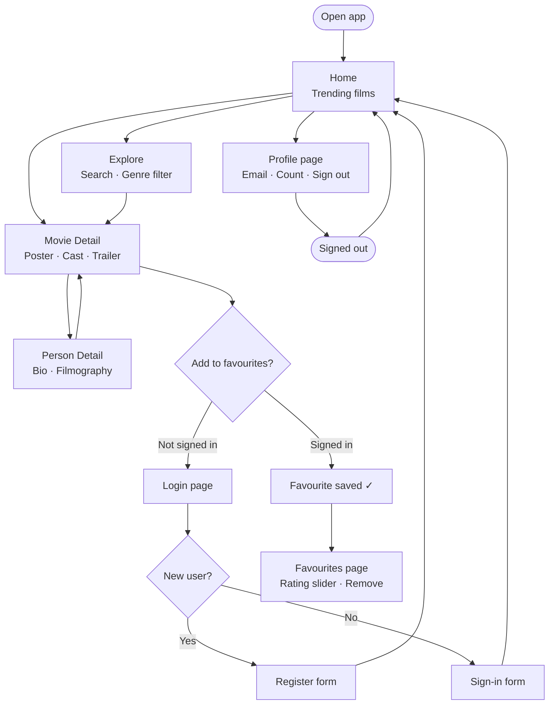
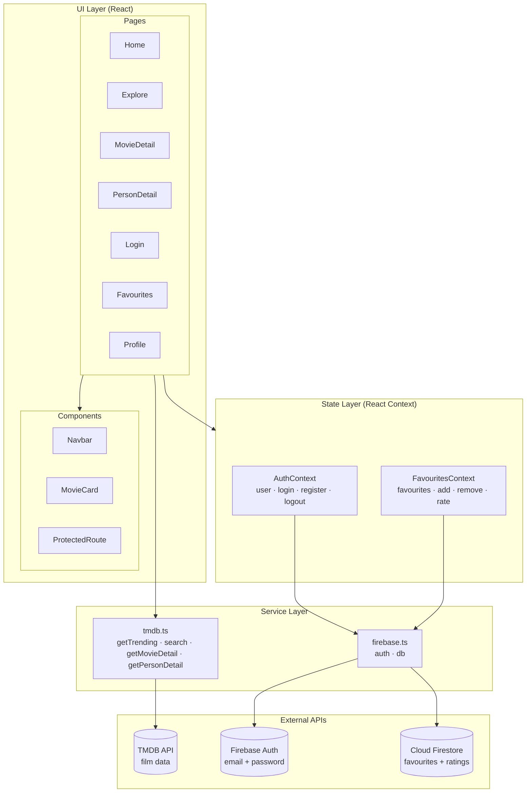

# The Film Shelf

A film discovery and personal collection web app built with React, TypeScript, and Firebase.

## Features

- **Home** — trending films of the week
- **Explore** — search by title or filter by genre
- **Film detail** — synopsis, cast strip, director, YouTube trailer
- **Person detail** — biography and filmography
- **Favourites** — personal collection with 1–10 rating, stored in Firestore
- **Authentication** — email/password sign-in and registration via Firebase Auth

---

## User flow



---

## Architecture



---

## Tech stack

| Layer | Technology |
|---|---|
| UI | React 19 + TypeScript |
| Routing | React Router v7 |
| Styles | CSS Modules |
| Auth | Firebase Authentication |
| Database | Cloud Firestore |
| Film data | TMDB API v3 |
| Build | Vite |
| Tests | Vitest + React Testing Library |

## Getting started

### 1. Clone the repo

```bash
git clone https://github.com/juannarowe/thefilmshelf.git
cd thefilmshelf
npm install
```

### 2. Set environment variables

Copy `.env.example` to `.env` and fill in your keys:

```bash
cp .env.example .env
```

```env
VITE_TMDB_API_KEY=your_tmdb_bearer_token

VITE_FIREBASE_API_KEY=...
VITE_FIREBASE_AUTH_DOMAIN=...
VITE_FIREBASE_PROJECT_ID=...
VITE_FIREBASE_STORAGE_BUCKET=...
VITE_FIREBASE_MESSAGING_SENDER_ID=...
VITE_FIREBASE_APP_ID=...
```

- **TMDB key**: create a free account at [themoviedb.org](https://www.themoviedb.org/) → Settings → API → copy the **Read Access Token**.
- **Firebase**: create a project at [console.firebase.google.com](https://console.firebase.google.com/), enable Authentication (Email/Password) and Firestore, then copy the config values.

### 3. Run locally

```bash
npm run dev
```

### 4. Build for production

```bash
npm run build
```

### 5. Run tests

```bash
npm test
```

## Project structure

```
src/
├── components/
│   ├── MovieCard/        # Reusable film card (poster, title, year)
│   ├── Navbar/           # Navigation bar (auth-aware)
│   └── ProtectedRoute/   # Redirects unauthenticated users to /login
├── context/
│   ├── AuthContext.tsx   # Firebase Auth state + login/register/logout
│   └── FavouritesContext.tsx  # Firestore favourites + rating
├── pages/
│   ├── Home/             # Trending films
│   ├── Explore/          # Search and genre filter
│   ├── MovieDetail/      # Film info, cast, trailer, favourites button
│   ├── PersonDetail/     # Person bio and filmography
│   ├── Favourites/       # Personal collection with rating slider
│   ├── Login/            # Sign in / Register form
│   └── Profile/          # User info and sign out
├── services/
│   ├── firebase.ts       # Firebase initialisation
│   └── tmdb.ts           # TMDB API functions
├── tests/
│   ├── setup.ts          # Testing Library setup
│   ├── getImageUrl.test.ts
│   ├── MovieCard.test.tsx
│   ├── Navbar.test.tsx
│   └── Login.test.tsx
└── types/
    └── index.ts          # TypeScript interfaces
```

## Git flow

This project follows a feature-branch workflow:

```
main
 └── develop
      ├── feat/epic-1-explore    → PR #1
      ├── feat/epic-2-detail     → PR #2
      ├── feat/epic-3-auth       → PR #3
      ├── feat/epic-4-favourites → PR #4
      └── testing                → PR #6
```

Each epic was developed on its own branch, reviewed via pull request, and merged into `develop`. A final PR merges `develop` into `main`.
